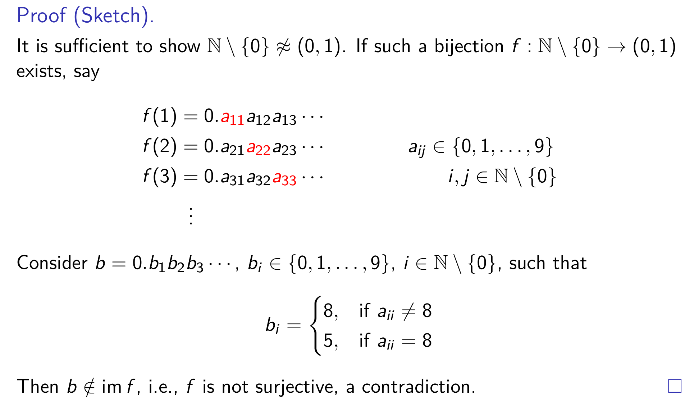
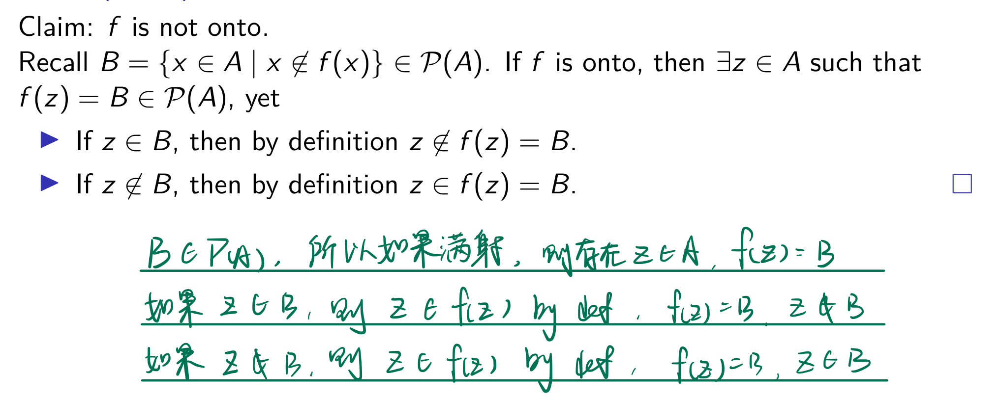

# VE203 RC2

> In RC2, we will review induction, including weak induction, strong induction, string, structural induction, some algebra knowledge, including monoid and monoid homomorphism, and equinumerosity. Induction is close to our intuition so it may not be that abstract but equinumerosity is tough so you should grasp the definition very well. Besides, relation will be discussed later since this part is close to partial order.

## Basic Structure

Induction is a rather powerful tool in proof. The core philosophy is that some things are not constructed randomly but elaborately-designed. Therefore, we can find inner pattern. Everything starts from the simplest situation, which is **base case**.

$(1) \ \text{base case: P(0) is correct}$

Then, things get more complicated (for natural number, number is getting bigger; string may get longer), so we have **inductive case**.

$(2) \ \text{inductive case: } \forall \ n \in \mathbb{N}, (\text{P(n)} \to \text{P(n+1)})$

What's important that in **inductive case**, $\text{P(n)}$ is the **Inductive Hypothesis**.

Therefore, the basic structure of induction is 
1. **Base Case**, 
2. **Inudctive Hypothesis**, 
3. **Inductive Case**

---

## Different Form of Induction

- Another form of normal induction
    1. All of $\text{P(0)}$, $\text{P(1)}$, $...$ , $\text{P(k−1)}$ are true.
    2. ($\forall \text{n}$)($\text{P(n)} \to \text{P(n+k)}$)
- Strong Induction
    1. $\text{P(0)}$
    2. ($\forall$ n $\geq$ 1), [$\text{P(0)} \land \text{P(1)} \land \text{P(2)} ... \land \text{P(n - 1)} \to \text{P(n)}$].
- Structural Induction
    1. From my point of view, I would like to say both induction follow the same philosophy (the construction of something like string and natural number follows a pattern), but they use different characteristic of that pattern.
    2. For natural number, we have addition (2 = 1+1). Therefore, we can use mathematical induction. This is a kind of `mathematical characteristic` of natural number. We can also perform structural induction since there is successor (will be discussed later; 2 is the successor of 1). This is kind of `structure characteristic` of natural number.
---

## An interesting topic: String

Before we jump into this topic, we should talk about algebraic basics.

### Monoid

**Definition**: A monoid is a triple $(M, e, \cdot)$, where $M$ is a set, together with an identity element $e$, and a function $M \times M \to M$, such that for all $m,n,p \in M$, the following monoid laws hold,
- $ m \cdot e = e \cdot m = m $ 
- $(m \cdot n) \cdot p = m \cdot (n \cdot p)$

Here follows a question: How to prove a monoid?
**Step 1.** Check identity element exists
**Step 2.** Check identity element is unique
**Step 3.** Check associativity

### Monoid Homorphism

**Definition**: A monoid homomorphism, or monoid morphisms, between two monoids $(M, *, e_M)$ and $(N, \cdot, e_N)$ is a function $f : M \to N$ such that
- $f (x * y) = f(x) \cdot f(y)$ for all $x, y \in M$, and
- $f (e_M) = e_N$.

Again! How to check?
**Only Step**: Follow the rules!!!!

### String

**Definition**: The set \( \Sigma^* \) of *strings* over the alphabet \( \Sigma \) is defined recursively by

- \( \varepsilon \in \Sigma^* \), where \( \varepsilon \) is the empty string containing no symbols.
- If \( a \in \Sigma \) and \( x \in \Sigma^* \), then \( ax \in \Sigma^* \), where \( ax := (a, x) \in \Sigma \times \Sigma^* \) is an ordered pair.

Note that \( \emptyset^* = \{\varepsilon\} \).

### String Operation

We can do a lot of interesting operation on string, including concatenation and reversal.

#### Concatentation

**Definition**: Let \( \Sigma \) be a set of symbols and \( \Sigma^* \) the set of strings over \( \Sigma \). We can define the concatenation of two strings, denoted by \( \cdot : \Sigma^* \times \Sigma^* \to \Sigma^* \), recursively as follows.

- If \( z \in \Sigma^* \), then \( \varepsilon \cdot z := z \), where \( \varepsilon \) is the empty string.
- If \( w, z \in \Sigma^* \) and \( w = ax \), then \( w \cdot z = ax \cdot z := a(x \cdot z) \).

Note: we can put **char** in the left handside of a **string** without any operator, like $\alpha x$. $\alpha$ is a character while $x$ is a string. However, if we want to concatentate two string, we have to use operator.

#### Length

**Definition**: The length of a string, \( \ell : \Sigma^* \to \mathbb{N}, w \mapsto \ell(w) \), can be recursively defined as:

- \( \ell(\varepsilon) = 0 \).
- \( \ell(ax) = 1 + \ell(x) \) if \( a \in \Sigma \) and \( x \in \Sigma^* \).

#### Reversal

**Definition**: We define the reversal of a string \( (\cdot)^R : \Sigma^* \to \Sigma^*, w \mapsto w^R \in \Sigma^* \) recursively by:

- \( \varepsilon^R = \varepsilon \)
- \( (ax)^R = x^R \cdot a\varepsilon \) for \( ax = (a, x) \in \Sigma \times \Sigma^* \).

We finish induction part here. In conclusion, this part is not abstract. As long as you follow the **basic structure** and apply the **rules** you have learned in class, you can solve almost all problems.

---

## Numbers and Equinumerosity

### Construction of Number Field

This part is interesting. We expand number field from natural number to ultimately to real number. This process is not very important so that we will not cover it in recitation class.

### Equinumerosity

**Definition**: A set \( A \) is equinumerous to a set \( B \) (written \( A \approx B \)) if there is a bijection from \( A \) to \( B \).

**Theorem**: For any sets \( A \), \( B \), and \( C \):  
- \( \vdash A \approx A \).  
- \( A \approx B \vdash B \approx A \).  
- \( (A \approx B \land B \approx C) \vdash A \approx C \).

While you may not directly face problems proving that one set is equinumerous to another, it's still important to review some proofs in your homework and slides.

Some example you need to remember:
- $\mathbb{N} \approx \mathbb{Z}$
- $\mathbb{N} \times \mathbb{N} \approx \mathbb{N}$
- $\mathbb{Q} \approx \mathbb{N}$

These examples all demonstrate a graphical way of thinking. You should keep that in mind.

### Cantor's Theorem

The proof of this theorem is much more important than theorem itself.

#### First Part

We want to prove $\mathbb{R} \not \approx \mathbb{N}$

**Note**: This is diagonal proof. You may meet problem that asks you to apply this kind of idea to other cases.

#### Second Part

We want to prove $\text{For every set } A, A \not \approx P(A)$

**Note**: This way to form contradiction is important.

### Dominate

**Definition** : A set \( A \) is dominated by a set \( B \) (written \( A \preceq B \)) if there is an injection from \( A \) to \( B \).

### Countable Sets

**Definition**: A set \( A \) is countable if \( A \preceq \mathbb{N} \). Otherwise, it is called uncountable.

### Cantor-Schröder-Bernstein Theorem

For sets $A$, $B$, and $C$,
- Reflexivity: $\vdash$ $A$ $\preceq$ $A$.
- Transitivity: $(A \preceq B) \land (B \preceq C) \vdash A \preceq C$.
- Antisymmetry: $(A \preceq B) \land (B \preceq A) \vdash A \approx B$.