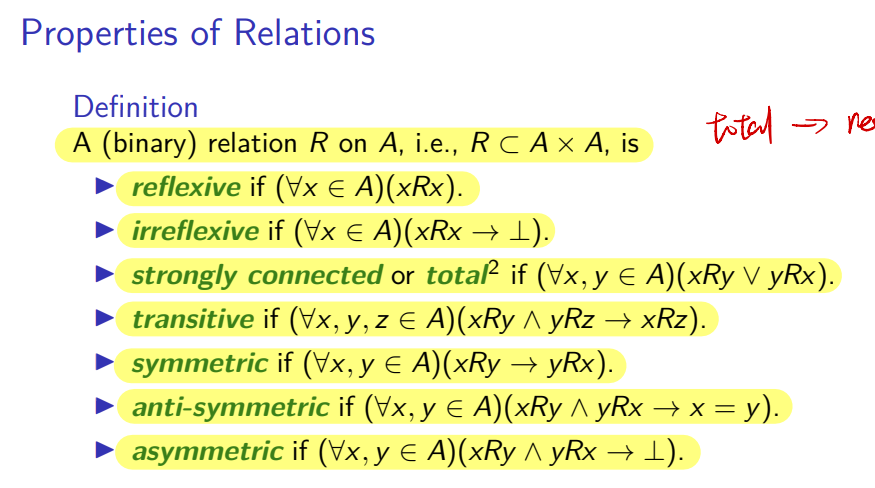

# VE203 Mid-term RC

> In this recitation class, we will breifly go over important content in logic, induction, algebra structure, and equinumerosity. In addition, we will review basic concept of pigeonhole principle, relation and partial order. After illustration of concept, exercise will be provided for you to get prepared for mid-term exam. Good luck!

## Logic

You must be very familiar with basic concept like logic operator, propostion, etc. We will omit these things in Recitation class. If you are not familiar with them, please review slides carefully!

We will only talk about `Natural Deduction`.

### Natural Deduction

**Basic process is as follows.**
1. Observing the pattern of conclusion and guess what rule may be used for the last step. (For example, negation should be introduced; $\lor$ is the core connective so it should be introduced or a negation should be cancelled at last)
2. Repeat step 1 to see whether you can make the whole tree (from the bottom to the top)
3. Make necessary assumption
4. Remember to use rule to discharge all assumption
5. If you find one way is false, please turn to another route
6. At last, please check whether you have discharged all assumptions, written all deduction symbols like "$\lor,\text{I}$" and made your answer easy to read.

**Note: Don't worry about the rules. They will be provided.**

---

## Induction

### Correct Use of Induction

First thing first, structure really matters. Please strictly follow the structure.

1. **Base Case**, 
2. **Inudctive Hypothesis**, (also write down "IH" at the exact step where you use it)
3. **Inductive Case**

Also, you should be able to distinguish weak induction, strong induction, structural induction. Please use correct induction method according to your need or instruction.

### String

**Definition**: The set \( \Sigma^* \) of *strings* over the alphabet \( \Sigma \) is defined recursively by

- \( \varepsilon \in \Sigma^* \), where \( \varepsilon \) is the empty string containing no symbols.
- If \( a \in \Sigma \) and \( x \in \Sigma^* \), then \( ax \in \Sigma^* \), where \( ax := (a, x) \in \Sigma \times \Sigma^* \) is an ordered pair.

Note that \( \emptyset^* = \{\varepsilon\} \).

**Pay attention to definition here. We are not able to put a character to the right hand side of a string. Please don't do that in exam.**

### String Operation

We can do a lot of interesting operation on string, including concatenation and reversal.

#### Concatentation

**Definition**: Let \( \Sigma \) be a set of symbols and \( \Sigma^* \) the set of strings over \( \Sigma \). We can define the concatenation of two strings, denoted by \( \cdot : \Sigma^* \times \Sigma^* \to \Sigma^* \), recursively as follows.

- If \( z \in \Sigma^* \), then \( \varepsilon \cdot z := z \), where \( \varepsilon \) is the empty string.
- If \( w, z \in \Sigma^* \) and \( w = ax \), then \( w \cdot z = ax \cdot z := a(x \cdot z) \).

Note: we can put **char** in the left handside of a **string** without any operator, like $\alpha x$. $\alpha$ is a character while $x$ is a string. However, if we want to concatentate two string, we have to use operator.

#### Length

**Definition**: The length of a string, \( \ell : \Sigma^* \to \mathbb{N}, w \mapsto \ell(w) \), can be recursively defined as:

- \( \ell(\varepsilon) = 0 \).
- \( \ell(ax) = 1 + \ell(x) \) if \( a \in \Sigma \) and \( x \in \Sigma^* \).

#### Reversal

**Definition**: We define the reversal of a string \( (\cdot)^R : \Sigma^* \to \Sigma^*, w \mapsto w^R \in \Sigma^* \) recursively by:

- \( \varepsilon^R = \varepsilon \)
- \( (ax)^R = x^R \cdot a\varepsilon \) for \( ax = (a, x) \in \Sigma \times \Sigma^* \).

**Pay attention to definition of each operation carefully! Never do concatentation between a character and a string!**

---

## Algebra Structure

### Monoid

**Definition**: A monoid is a triple $(M, e, \cdot)$, where $M$ is a set, together with an identity element $e$, and a function $M \times M \to M$, such that for all $m,n,p \in M$, the following monoid laws hold,
- $ m \cdot e = e \cdot m = m $ 
- $(m \cdot n) \cdot p = m \cdot (n \cdot p)$

### Monoid Homomorphism

**Definition**: A monoid homomorphism, or monoid morphisms, between two monoids $(M, *, e_M)$ and $(N, \cdot, e_N)$ is a function $f : M \to N$ such that
- $f (x * y) = f(x) \cdot f(y)$ for all $x, y \in M$, and
- $f (e_M) = e_N$.

**If a problem asks you to check whether a set with an operator is a monoid or check whether a mapping is a monoid homomorphism, what you need to do is to follow the definitions and verify them.**

**Therefore, please make sure you can recall the definitions during the exam.**

---

## Relation

**Definition**: A subset \( R \subseteq A \times B \) is called a (binary) relation from \( A \) to \( B \). The domain and range of \( R \) is given by

- **Domain**: \( (\text{domain}(R)) := \{ x \mid \exists y (x R y) \} \)

- **Range**: \( (\text{range}(R)) := \{ y \mid \exists x (x R y) \} \)

If \( A = B \), we say that \( R \) is a relation on \( A \).

Note: Since R is a set, we often write R = $\{(a,b), ...\}$

E.g. R is a relation on $[2]$, R = $\{(0,0),(1,1),(2,2),(3,3)\}$. This means $0$R$0$, $1$R$1$, $2$R$2$, $3$R$3$.

### Operations on Relations/Functions

For arbitrary sets/relations/functions \( A \), \( F \), and \( G \):

- The inverse of \( F \) is the set
  \[
  F^{-1} = \{ (y, x) \mid x F y \}
  \]

- The composition of \( F \) and \( G \) is the set (beware of the order)
  \[
  F \circ G = \{ (x, z) \mid \exists y (x G y \land y F z) \}
  \]

- The restriction of \( F \) to \( A \) is the set
  \[
  F|_A = \{ (x, y) \mid (x F y \land x \in A) \}
  \]

- The image of \( A \) under \( F \) is the set
  \[
  F(A) = \text{im}(F|_A) = \{ y \mid (\exists x \in A)(x F y) \}
  \]

If \( F \) is a function, then
\[
F(A) = \{ F(x) \mid x \in A \}.
\]

### Injection & Surjection

Given a function \( F : A \to B \), with \( \text{dom}(F) = A \) and \( \text{im}(F) \subseteq B \):

- \( F \) is **injective** or **one-to-one** if 
  \[
  \forall x, y \in A \, (F(x) = F(y) \implies x = y).
  \]

- \( F \) is **surjective** or **onto** if 
  \[
  \text{im}(F) = B.
  \]

- \( F \) is **bijective** if it is both injective and surjective.

#### Theorem

Given \( f : A \to B \), \( g : B \to C \), \( A \neq \emptyset \), then:

- If \( g \circ f \) is injective, then \( f \) is injective.

- If \( g \circ f \) is surjective, then \( g \) is surjective.

Note: Injection and surjection may not be tested, but you still need to remember some properties.

### Special Properties of Relation

**Note: they are really important. Please remember them well!**