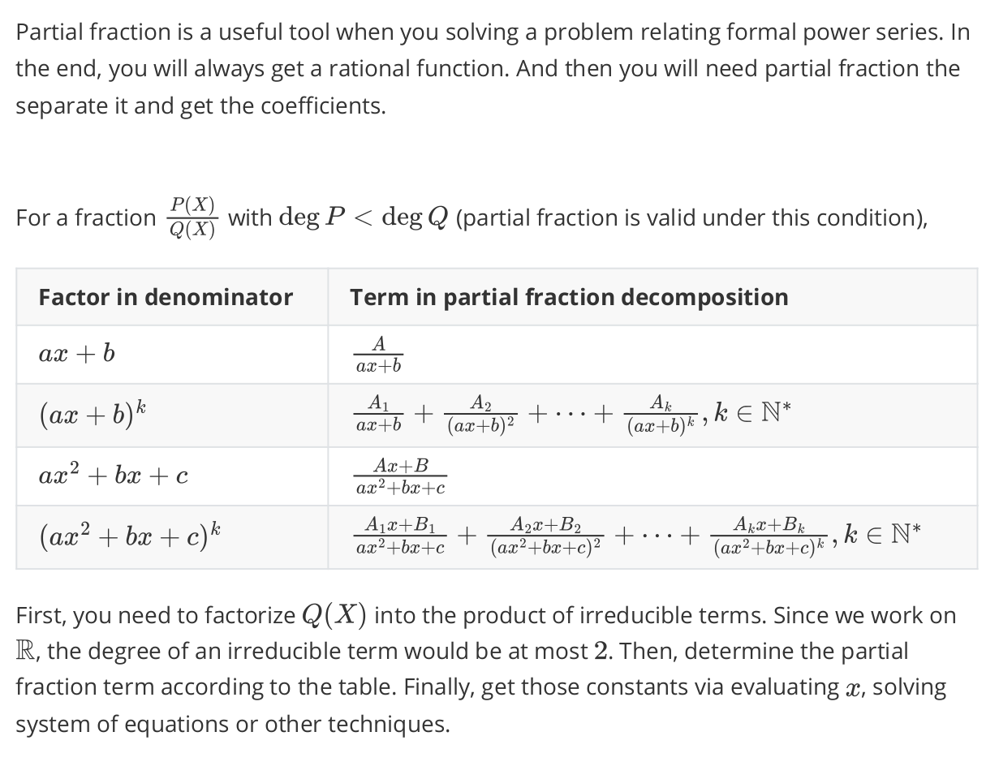
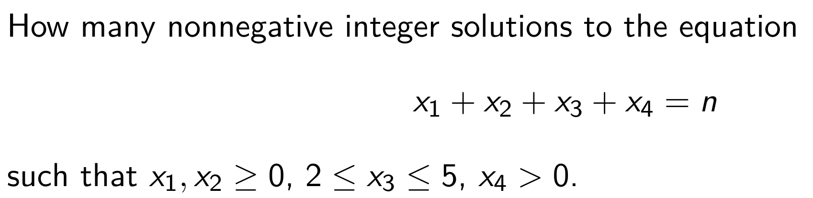

# VE203 RC4

> In RC4, we will go over all contents in Part 2, i.e Counting Problem. We will first talk about formal power series，and then with this powerful weapon we can work on more difficult problems. This part can be kind of hard from the perspective of calculation. So please make sure write as many steps as you can.

## Formal Power Series

**Definition:** A **formal power series** is an expression  
\[
A(x) = \sum_{n \geq 0} a_n x^n
\]
which is called the **generating function** of the sequence \((a_n)_{n \in \mathbb{N}}\).

- \(x\) is usually called the **variable** or **indeterminate**.
- \(x\) is identified with the sequence \((0, 1, 0, 0, \dots)\).
- **"Symbolically"** \(a_0 = A(0)\).
- We can extract the scalar coefficients as \([x^n] A(x) = a_n\).
- In general, the scalar coefficients could be taken as elements of an arbitrary ring \(R\), we write \(A(x) \in R[[x]]\).

### Properties

- Equality
- Addition
    + commutative
    + associative
    + additive identity
    + additive inverse
- Multiplication
    + commutative
    + associative
    + multiplicative identity
    + Distributivity

**Details are omitted so that it can force you to go over slides!**

### Invertibility

A **formal power series** \(A(x)\) is **invertible** if there exists \(B(x)\) such that  
\[
A(x)B(x) = 1.
\]

if \(A(0) \neq 0\), then \(A(x)\) is invertible.

### Composition of Formal Power Series

Let \(A(x)\) and \(B(x)\) be formal power series. If \(a_0 = 0\) or \(B(x)\) is a polynomial, then   the **composition** is given by: 

\[
(B \circ A)(x) = B(A(x)) = \sum_{n \geq 0} b_n A(x)^n
\]

### Derivative
Let \(A(x) = \sum_{n \geq 0} a_n x^n\) be a formal power series, then the **formal derivative** of \(A(x)\) is given by  
\[
DA(x) = \sum_{n \geq 0} n a_n x^{n-1} = \sum_{n \geq 0} (n+1) a_{n+1} x^n
\]

#### A Few Properties
Given \(A(x)\) and \(B(x)\) as formal power series, then:  

- \(D(\alpha A + \beta B) = \alpha DA + \beta DB\), where \(\alpha, \beta\) are scalars  
- \(D(AB) = (DA)B + A(DB)\)  
- \(D(B \circ A) = (DB \circ A)(DA)\), given \(a_0 = 0\), or \(B(x)\) is a polynomial  
- \(D(1/A) = -DA / A^2\), given \(a_0 \neq 0\)  
- \(D(A^n) = nA^{n-1}(DA)\)  

---

## Linear Recurrence

You may well be asked to solve linear recurrences using the method of generating functions in the exam. **Follow these steps:**

- **Define** \( A(x) = \sum_{n \geq 0} a_n x^n \)
- **Sum up both sides** of the recurrences, and substitute the sums with \( A(x) \).
- **Use partial fractions** to split the expression. Then use binomial theorem or other techniques to expand it.
- **Extract the \( n \)-th term** of \( A(x) \).

### Partial Fraction

### A Complete Example

E.g. \(a_{n+2} - 4a_{n+1} +3 a_n = n \cdot 2^n\)

I will lead you to solve this problem to see how our method works.

---

## Binomial Theorem

> The key of this part is interchanging order and calculation.

Let \(m \in \mathbb{Q}\), \(k \in \mathbb{N}\), define  
\[
\binom{m}{0} := 1,
\]  
and  
\[
\binom{m}{k} := \frac{m(m-1)\cdots(m-k+1)}{k!}.
\]

Note that if \(m \in \mathbb{N}\), then  
\[
\binom{m}{k} = \frac{m!}{k!(m-k)!}.
\]

### Important Identity
- \[
(1 + x)^{-d} = \sum_{n \geq 0} \binom{-d}{n} x^n = \sum_{n \geq 0} (-1)^n \binom{d + n - 1}{n} x^n
\]

- \[
(1 - x)^{-d} = \sum_{n \geq 0} \binom{-d}{n} (-x)^n = \sum_{n \geq 0} \binom{d + n - 1}{n} x^n
\]

- \[
(1 + x)^n = \sum_{k \geq 0} \binom{n}{k} x^k = \sum_{k=0}^n \binom{n}{k} x^k \quad \text{if } n \in \mathbb{N}
\]

- \[
\frac{x^k}{(1 - x)^{k+1}} = \sum_{n \geq 0} \binom{n}{k} x^n = \sum_{n \geq k} \binom{n}{k} x^n
\]

**You should remember them well.**

### Catalan Number 

\(C_n = \binom{2n}{n} \cdot \frac{1}{n + 1}\)

### How to Calculate

See Segner’s recurrence relation.

---

## Principle of Inclusion-Exclusion

We will first introduce the general solution to Counting Problem.

### General Solution

### PIE 

Let \( A_1, \dots, A_n \) be subsets of \( X \). Then the number of elements of \( X \) which lie in none of the subsets \( A_i \) is

\[ \left| X - \bigcup_{i=1}^n A_i \right| = \sum_{I \subseteq [n]} (-1)^{|I|} \left| \bigcap_{i \in I} A_i \right|
= \sum_{r \geq 0} (-1)^r \sum_{|I| = r} \left| \bigcap_{i \in I} A_i \right| \]

which we usually write as

\[
\left| X - \bigcup_{i=1}^n A_i \right| = |X| - \sum_{1 \leq i \leq n} |A_i|  + \sum_{1 \leq i < j \leq n} |A_i \cap A_j|  \\ - \sum_{1 \leq i < j < k \leq n} |A_i \cap A_j \cap A_k| 
\pm \dots + (-1)^n \left| A_1 \cap A_2 \cap \dots \cap A_n \right|.
\]

#### Application

- Derangement

The number of derangements of the set \([n]\) is given by

\[
d_n = \sum_{i=0}^n (-1)^i \binom{n}{i} (n-i)! = n! \sum_{i=0}^n \frac{(-1)^i}{i!}.
\]

- Counting Surjection

Let \( k \geq n \). The number of surjections \( f : [k] \to [n] \) is given by

\[
S_{k,n} = \sum_{i=0}^{n-1} (-1)^i \binom{n}{i} (n-i)^k.
\]

## Asymptotic Notation