# VE203 RC6

> Congrats! We finally reach the end of the semester. This is the final recitation class and I will provide a checklist for you.

## Linear Recurrence Relation

- How to solve a linear Recurrence Relation?
    - Please use Formal Power Series and Generating Function.
    - Properly set Formal Power Series.
    - Use partial fraction to make calculation easier.

e.g

Given the recurrence relation:  

\[
a_{n+2} - 4a_{n+1} + 3a_n = n2^n, \quad n \geq 0
\]

with \( a_0 = 1 \), \( a_1 = 2 \).  
We have  

\[
\sum_{n \geq 0} \left( a_{n+2} - 4a_{n+1} + 3a_n \right)x^n = \sum_{n \geq 0} n2^n x^n
\]

Let \( A(x) = \sum_{n \geq 0} a_n x^n \), then  

\[
\frac{A(x) - 1 - 2x}{x^2} - 4 \frac{A(x) - 1}{x} + 3A(x) = \frac{2x}{(1 - 2x)^2}
\]

## Formal Power Series

- How to perform calculation?
    - Review slides.
    - Do remember those properties well.

e.g

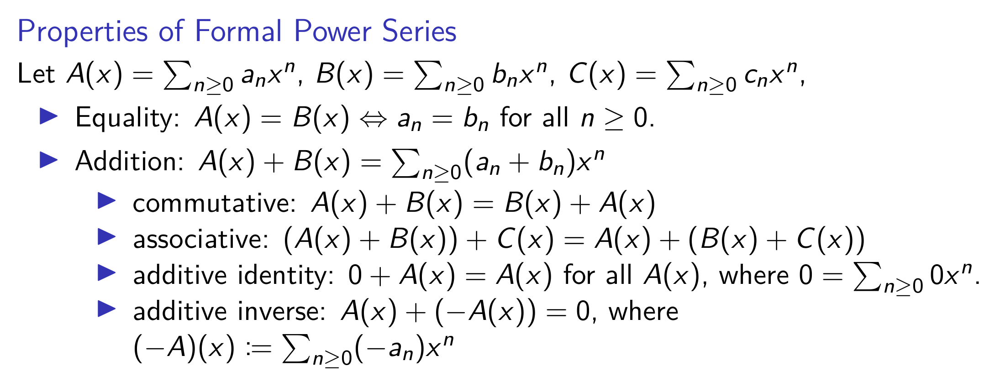

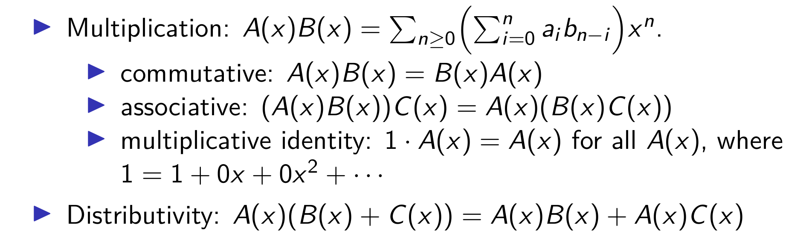

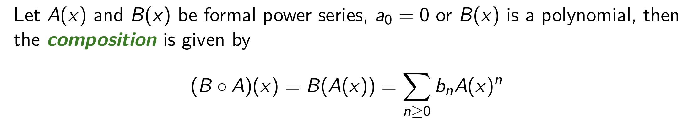

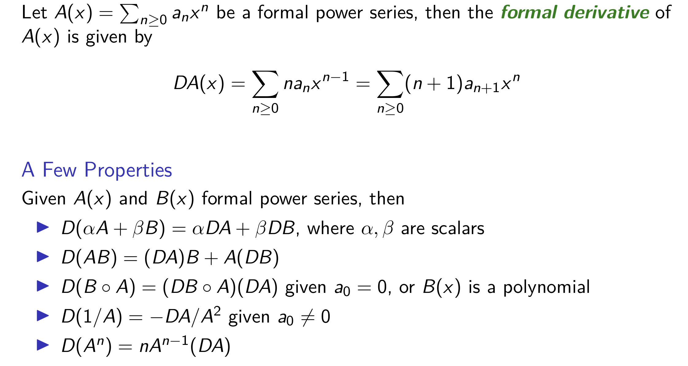

- How to find inverse power series?
    - \(a_0 \neq 0\)
    - Use geometric series. 

## Binomial Theorem

- Why we learn Binomial Theorem?
    - When we use formal power series to solve counting problems, we intend to find the coefficient of certain terms. Binomial Theorem helps us to find those terms.

- What should we remember?
    - Four identities.
    - Definition of \(\binom{m}{k}\).

- \[
(1 + x)^{-d} = \sum_{n \geq 0} \binom{-d}{n} x^n = \sum_{n \geq 0} (-1)^n \binom{d + n - 1}{n} x^n
\]

- \[
(1 - x)^{-d} = \sum_{n \geq 0} \binom{-d}{n} (-x)^n = \sum_{n \geq 0} \binom{d + n - 1}{n} x^n
\]

- \[
(1 + x)^n = \sum_{k \geq 0} \binom{n}{k} x^k = \sum_{k=0}^n \binom{n}{k} x^k \quad \text{if } n \in \mathbb{N}
\]

- \[
\frac{x^k}{(1 - x)^{k+1}} = \sum_{n \geq 0} \binom{n}{k} x^n = \sum_{n \geq k} \binom{n}{k} x^n
\]

## Principle of Inclusion-Exclusion

- What is PIE?

- How to use PIE in counting problems?
    - Derangement.
    - Counting Surjection.

## Asymptotic Notations

- What do different symbols mean?
    - Big O
    - Omega
    - Theta

## Master Theorem

- How to use Master Theorem?
    - First judge the relationship between coefficients. 
    - Then choose appropriate formula.

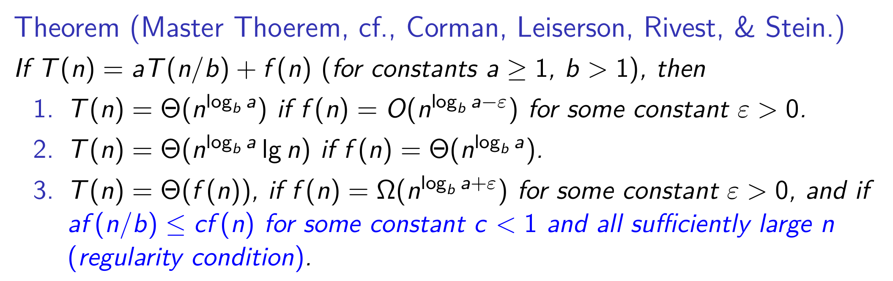

## Number Theory

- How to show there exist infinitely many primes which are of certain term?
    - Use Euclid’s proof to construct a set.

- How to perform Euclidean algorithm?
    - Follow the step.

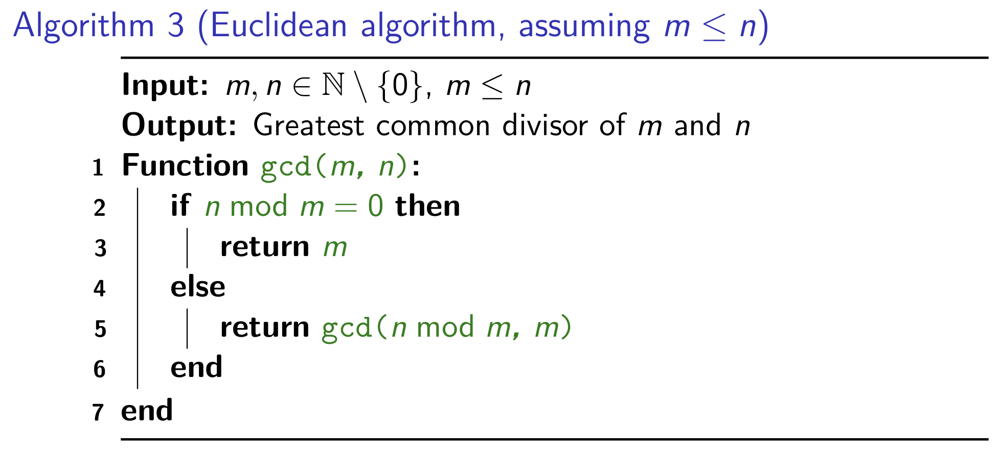

- How to find integer solutions for a Diophantine equation?
    - Use Euclidean algorithm by back-tracking.
    - Some time, there will exist no integer solution for a diophantine equation. For a equation \(ax + by = c\), if \(gcd(a,b) \nmid c, no integer solution.\)

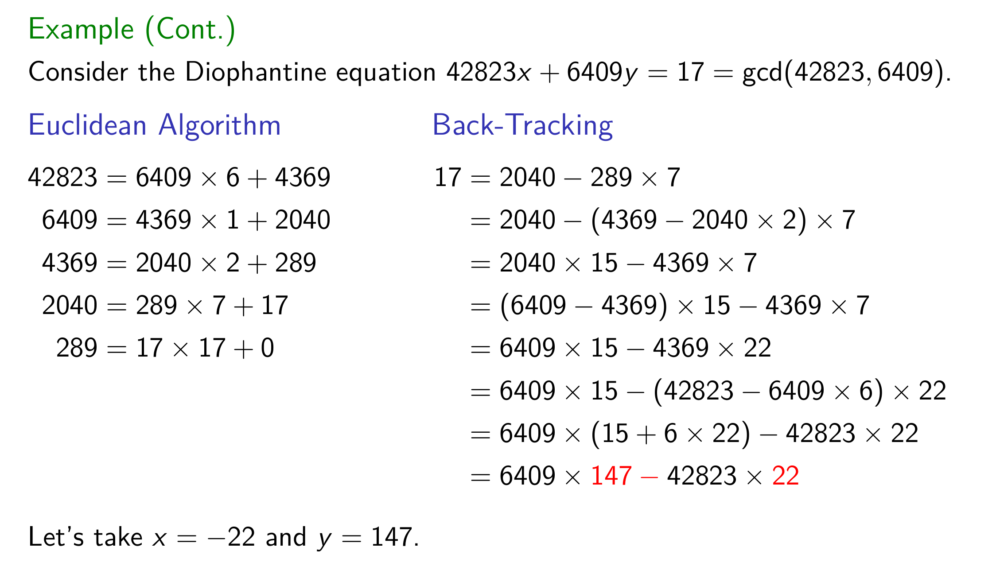

- What is congruent modulo?
    - Pay attention to notation here.
    - Although all kinds of theorem won't be tested, you should go over them.
    - \(\overline{a} + \overline{b} = \overline{a+b}\)
    - \(\overline{a} \cdot \overline{b} = \overline{a \cdot b}\)

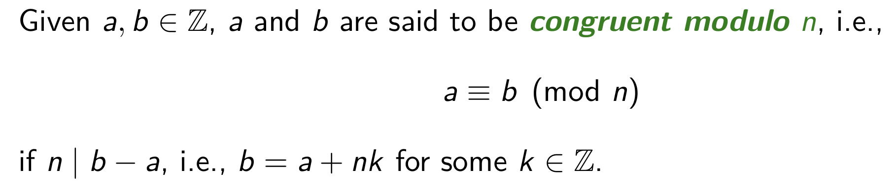

- How to find inverse?

Eg. 
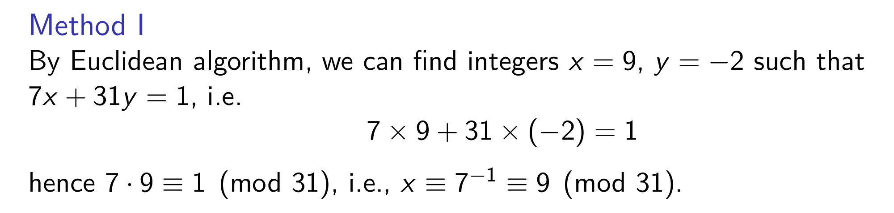

- Fermat Primality Test
    - Go over this method.

- How to solve Sunzi Problem?

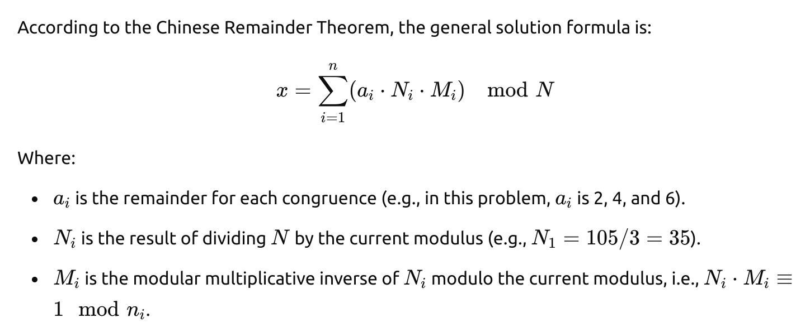

- How to calculate RSA?

Eg.
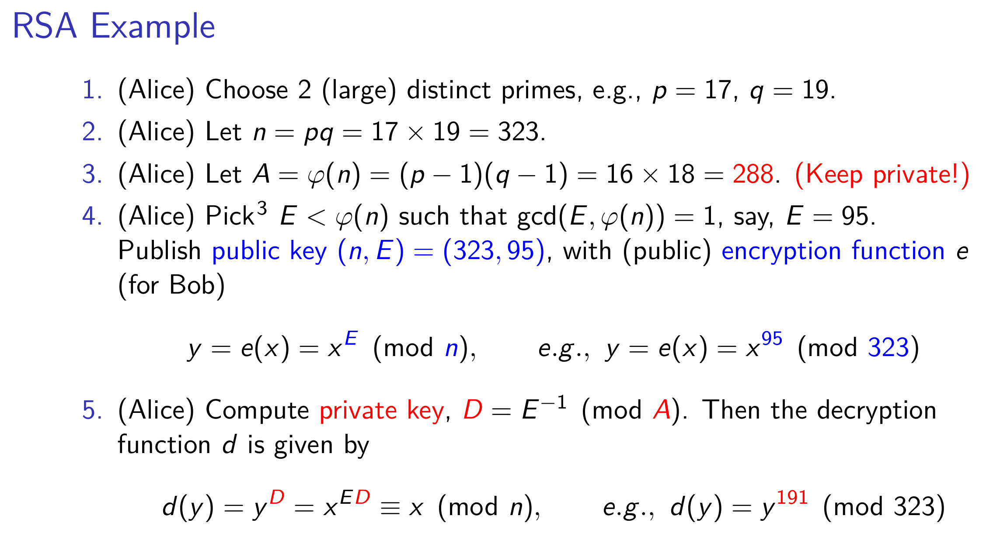

## Group Theory

- What is a group?

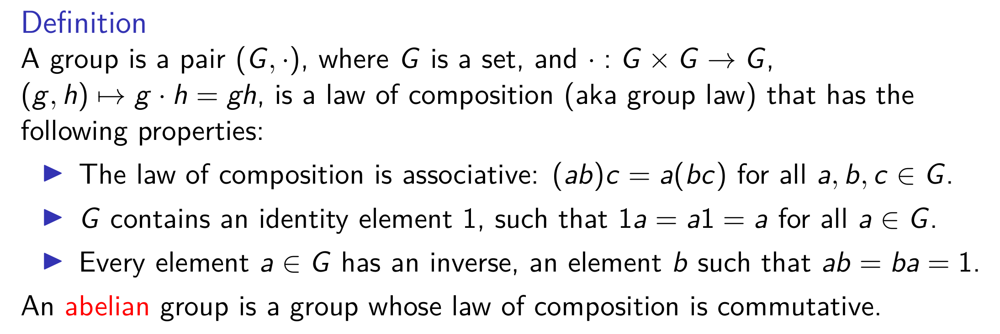

- What is a subgroup? 
    - A subgroup is a subset of a group that is itself a group under the same operation as the original group.

- What is a cyclic group?
    - Generated by a single elements, i.e \(x\).
    - Smallest group that contains \(x\).
    - Let assume a cyclic group \(G\). The order of G is given by the number of elements of \(G\).

- What is symmetric group?

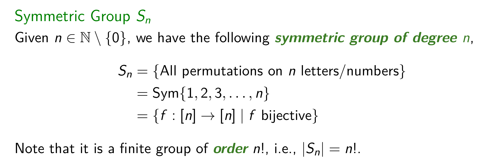

- What is homomorphism?
    - Please remember the properties.
    - Please remember what is `image` and `kernel`.
    - A homomorphism is injective iff \(ker f = \{ 1G \}\).
    - Isomorphism is a bijective homomorphism.

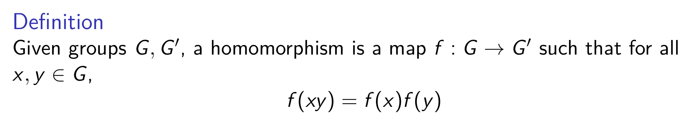

- What is coset?
    - coset itself is an equivalence class.
    - The number of left cosets of a subgroup is called the index of \(H\) in \(G\). The index is denoted by \([ G : H ]\) (which could be infinite if |\(G\)| = \(\infty\)).
    - |\(G\)| = |\(H\)| \(\cdot\) [\(G\) : \(H\)]

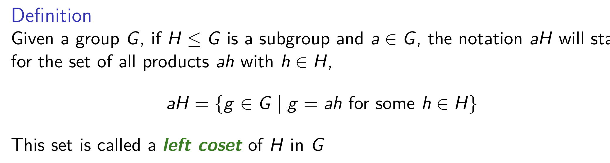

- What is Lagrange Theorem?
    - Let \(H\) be a subgroup of a finite group \(G\). The order of \(H\) divides the order of \(G\).
    - Given a group \(G\), with |\(G\)| = \(p\) prime. Let \(g\) ∈ \(G\), \(g\) \(\neq \) 1, then \(G\) = <\(g\)> which is cyclic.

- What is normal subgroup?

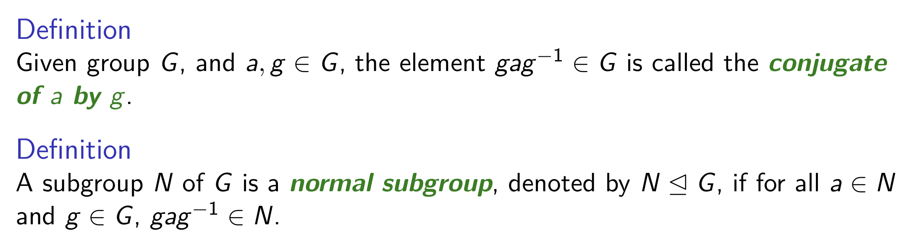

## Graph Theory

- What is a graph?
    - vertice, edge, incidence, adjacent
    - loop, parallel, simple
    - isomorphism
    - complement
    - null graph, complete, clique
    - path, cycle
    - subgraph
    - degree

- What is connectivity?
    - Walk, length
    - connected
    - Given $H_1$ , $H_2 \subseteq  G$, $H_1$, $H_2$ connected graphs, and $V(H_1)$ $\bigcap$ $V(H_2)$ $\neq$ $\emptyset$, then $H_1 \bigcup H_2$ is connected.
    - maximal, maximum
    - component
    - cut-edge, bridge

- What is bipartition?

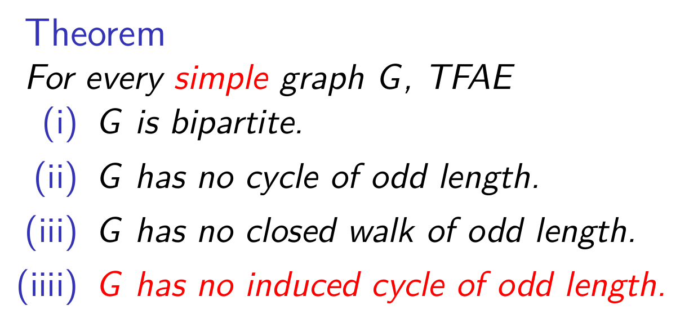

- What is matching?
    - maximal, maximum, covers
    - Hall's Theorem
    - Kőnig-Egerváry Theorem
    - Graph Homomorphism, Graph Isomorphism

- What is a tree?
    - Forest, tree, leaf

- What is a spanning tree?
    - Several theorems.

- How to apply Kruskal’s Algorithm?

- How to apply Dijkstra’s Algorithm?