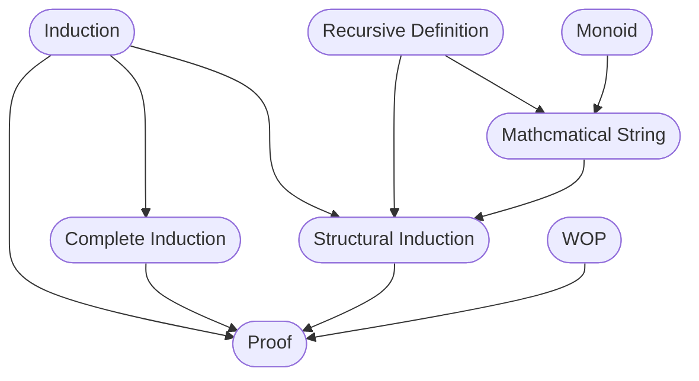
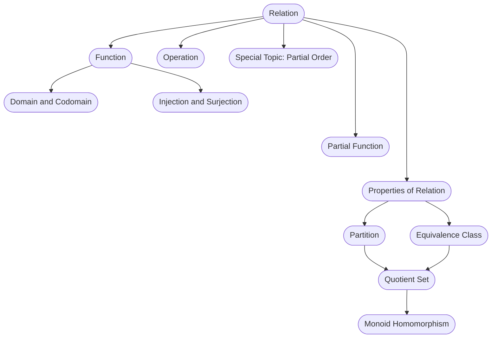
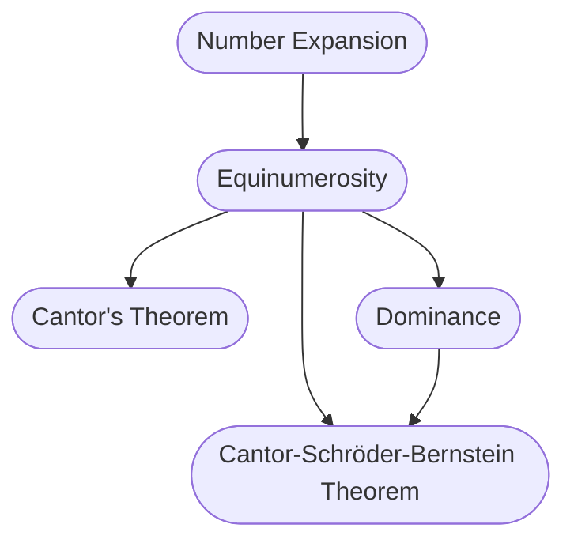
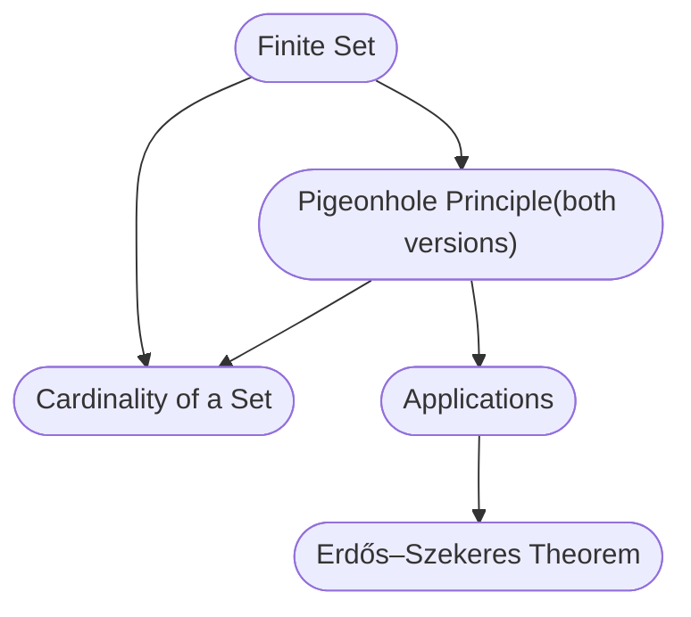
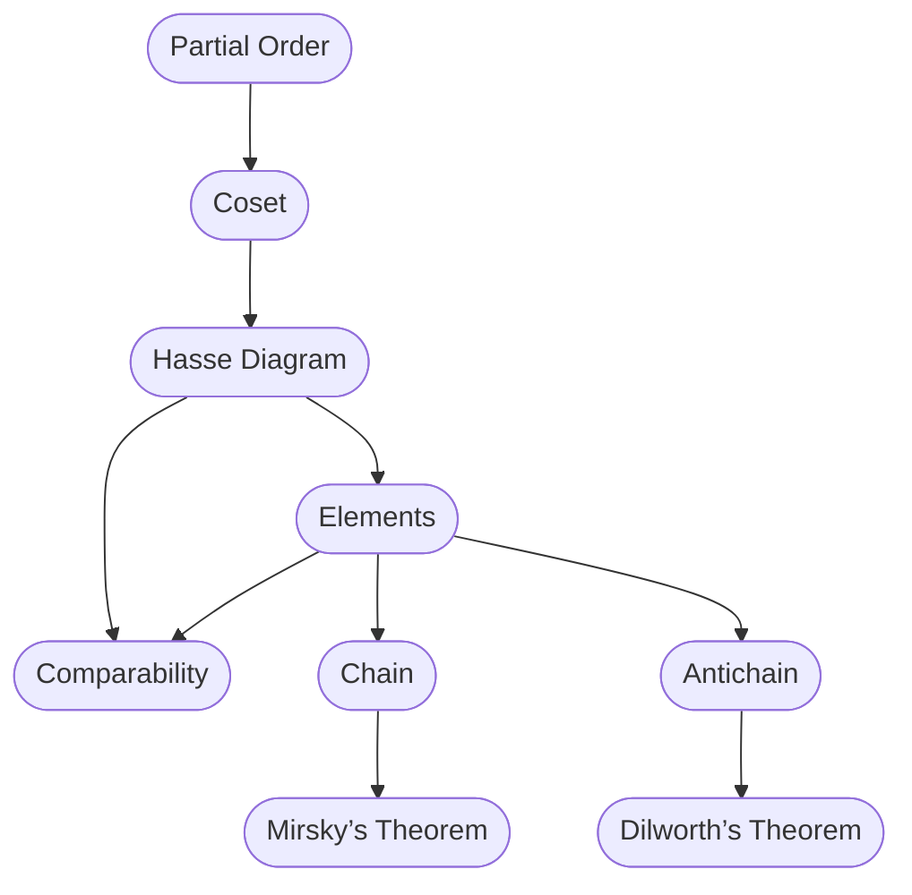
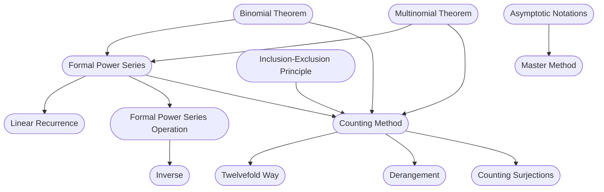
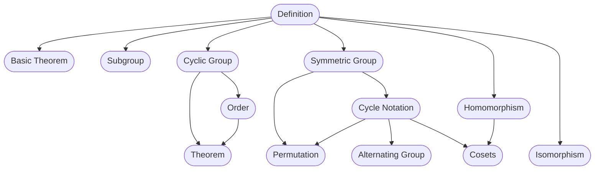

# VE203 rc0

> In rc0, I will lead to browse all topics covered in this course and give you some tips on how to grasp the essence of this course. VE203 is interesting, however, as its name indicates, is discrete. I hope these graphs can help you have a glance at the course in the beginning of the semester.

## Basic Set Theory and Logic

The content in this section connects the `set` we have learned in high school with more interesting properties. This is fundamental in many field, including computer science. There are many concepts and they are related. A graph is shown below.

## Induction and Recursion

Many things in this world are not chaotic; rather, there exist some hidden rules. Induction and Recursion employ these rules to find some properties. Induction is useful to learn new things. For instance, we use induction to verify the correctness of an algorithm. A graph below shows what we will learn.

## Relation, Function and Order

These are important topics in this course. We are discussing interesting relations between numbers, functions and exploring order of things. Relation is important for algorithm.

## Numbers and Equinumerosity

We will explore how people find new numbers. Equinumerosity in some way shows relationship between two sets or fields. With this, we can explore more about a set.

## Pigeonhole Principle

This is not a new friend. Most of us are already familiar with him. With the principle, we can easily do some proof. We won't dive deep into it, and graph below shows the content.

## Partial Order

Partial order is a special topic here. It will be discussed after mid-term exam. It reveals a special but fundamental relation between things. A graph below shows what we will learn.

## Counting

This is the most interesting part of discrete mathematics. We have learned power series in first-year math course. However, here we will use this method to solve some counting problem. A graph below shows details. I have to admit there are so many things but in fact each topic corresponds to one particular problem.

## Group

One of the interesting part of Discrete Mathematics is algebra structure. Algebra structure well organizes similar things so that we can find a template to simplify them. From my point of view, this is the most difficult part of this course. A graph below shows the content.

**These are everything we should learn in this semester. In the first half of the semester, we will cover content before partial order. This part includes a lot of abstract concepts. The way to grasp them is to think more and give more examples by yourselves.**