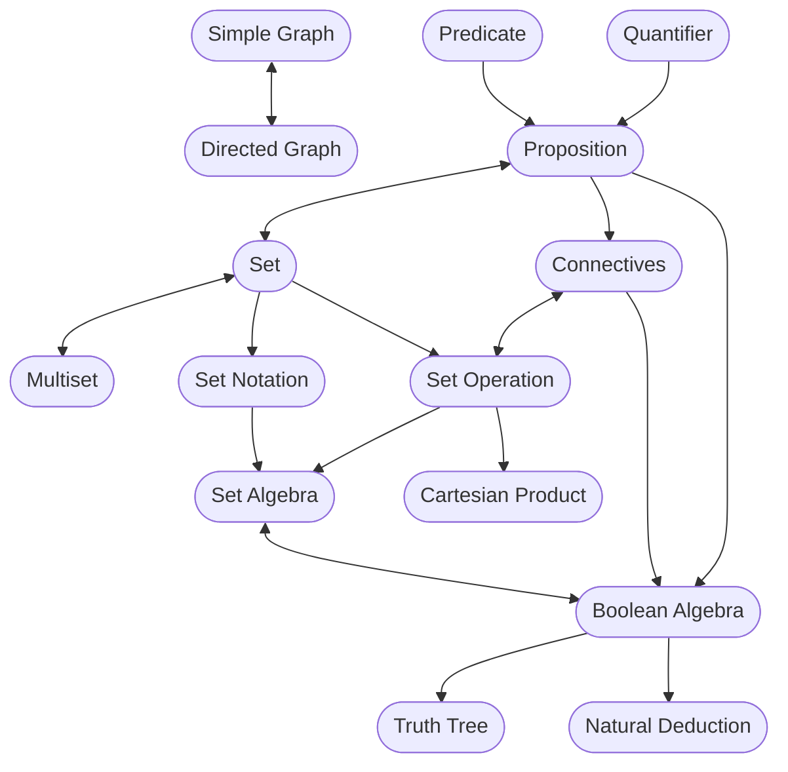

# VE203 rc0

Again, welcome to VE203. This is one of my favourate courses at Joint Institute. I hope we can share the same feeling at the end of semester. In rc0, I will lead to browse all topics covered in this course and give you some tips on how to grasp the essence of this course.

## Basic Set Theory and Logic

The content in this section connects the `set` we have learned in high school with more interesting properties. A graph is shown below.

## Induction and Recursion

Many things in this world are not chaotic; rather, there exist some hidden rules. Induction and Recursion employ these rules to find some properties.

## Relation, Function and Order

These are important topics in this course. We are discussing interesting relations between numbers, functions and exploring order of things.

## Numbers and Equinumerosity

We will explore how people find new numbers.

```mermaid
    graph
    A(["Expansion"])
    B(["Equinumerosity"])
    C(["Cantor's Theorem"])
    D(["Dominance"])
    E(["Cantor-Schröder-Bernstein Theorem"])
    A --> B
    B --> C
    B --> D
    B --> E
    D --> E
```

